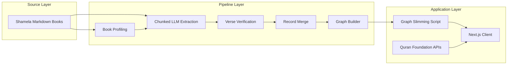

# Architecture

## System Overview

## Key Boundaries

- `pipeline/` handles extraction, validation, and graph construction.
- `data/` stores source corpus and open dataset artifacts.
- `client/` handles user-facing exploration and API-driven enrichment.

## Further Reading

- [Pipeline Iterations & Lessons Learned](LESSONS_LEARNED.md): A detailed history of the engineering challenges and solutions encountered while building the data extraction pipeline.
