# Pipeline Documentation

## End-to-End Flow

```mermaid
flowchart LR
  sourceBooks["data/sources/*.md"] --> profileStep["profile_books.py"]
  profileStep --> bookProfiles["pipeline/book_profiles/*.json"]
  bookProfiles --> extractStep["pipeline.cli.extract"]
  sourceBooks --> extractStep
  extractStep --> runRecords["pipeline/output/book_slug/run_id/records.jsonl"]
  runRecords --> mergeStep["merge_records.py"]
  mergeStep --> mergedRecords["pipeline/output/merged/*.jsonl"]
  mergedRecords --> graphStep["build_ayah_graph.py"]
  graphStep --> fullGraph["pipeline/output/ayah_graph.json"]
  fullGraph --> slimStep["client/scripts/build_graph_data.py"]
  slimStep --> webGraph["client/public/data/graph.json"]
```



## Core Commands

Use Python 3.12 in PowerShell:

```powershell
$py = "C:\Users\ElhassanElboraey\AppData\Local\Programs\Python\Python312\python.exe"
```

### Profile one book

```powershell
& $py -m pipeline.scripts.profile_books --source data/sources profile --book book_22_iskafi_durra_tanzil
```

### Extract one book

```powershell
& $py -m pipeline.cli.extract --book book_22_iskafi_durra_tanzil --source data/sources
```

### Batch run

```powershell
& $py pipeline/scripts/run_all.py
```

### Merge records

```powershell
& $py pipeline/scripts/merge_records.py
```

### Build full graph

```powershell
& $py pipeline/scripts/build_ayah_graph.py
```

### Build frontend graph payload

```powershell
& $py client/scripts/build_graph_data.py
```

## Output Structure

- `pipeline/output/book_<slug>/<run_id>/records.jsonl`
- `pipeline/output/book_<slug>/<run_id>/extraction_state.json`
- `pipeline/output/book_<slug>/<run_id>/run_log.json`
- `pipeline/output/merged/book_<slug>.jsonl`
- `pipeline/output/ayah_graph.json`

## Environment Variables

From `.env`:

- `GEMINI_API_KEY`
- `GEMINI_MODEL` (optional)
- `DEEPSEEK_API_KEY` (optional; for DeepSeek runs)
- `LLM_PROVIDER` (`gemini` or `deepseek`)
- `PIPELINE_OUTPUT_DIR` (optional override)

## Adding a New Book

1. Add source markdown to `data/sources/`.
2. Ensure its Shamela ID is mapped in `pipeline/mutashabihat/registry.py`.
3. Run profiling.
4. Run extraction.
5. Merge + rebuild graph.

## Operational Notes

- Extraction is resumable via `extraction_state.json`.
- Chunk-level failures are tracked and can be retried.
- Record validation and verse verification run before write.
- For a detailed history of the pipeline's development, challenges, and engineering solutions (such as our hybrid entry-aware chunking strategy), see [Pipeline rIterations](Pipeline_Iterations.md).
