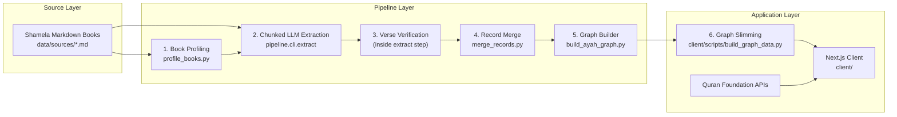

# Pipeline

This folder contains the full extraction and graph construction backend for Mishkāt — from raw Shamela markdown books to the verse adjacency graph consumed by the frontend.

---

## System Overview



---

## Pipeline Steps

### 1. Profile — `profile_books.py`

Analyses each source book's internal structure: entry boundaries, verse citation format, and explanation patterns. Writes a per-book JSON profile to `pipeline/book_profiles/` that the extraction step uses to guide chunking and prompting.

```powershell
# List all books and their profile status
& $py -m pipeline.scripts.profile_books --source data/sources list

# Profile a single book
& $py -m pipeline.scripts.profile_books --source data/sources profile --book book_22_iskafi_durra_tanzil

# Profile all books
& $py -m pipeline.scripts.profile_books --source data/sources profile --all
```

---

### 2. Chunk + Extract — `pipeline.cli.extract`

Splits each source book into ~600-token chunks (with 80-token overlap) and sends each chunk to the LLM with a structured extraction prompt. The LLM returns an array of verse-relationship records per chunk. Records are written to `pipeline/output/<slug>/<run_id>/records.jsonl`.

**Resumable** — completed chunks are tracked in `extraction_state.json` and skipped on re-run. Failed chunks are logged and can be retried.

```powershell
& $py -m pipeline.cli.extract --book book_22_iskafi_durra_tanzil --source data/sources
```

---

### 3. Verify — (runs inside the extract step)

After the LLM extracts a record, verse references are immediately verified against the local Quran dictionary (`data/quran/`):

1. Validates that the `surah:ayah` reference exists.
2. Fuzzy-matches the extracted text snippet against the dictionary (threshold: 0.85).
3. Auto-fills `surah_name_ar`, `surah_name_en`, `juz`, `hizb_quarter`, `text_uthmani` from the dictionary.
4. Stores a `confidence` score in the record — low-confidence records are flagged rather than silently dropped.

This step exists because LLMs hallucinate verse text and references. The dictionary is the ground truth.

---

### 4. Merge — `merge_records.py`

Deduplicates records across multiple extraction runs for the same book (later run wins on conflict). Writes one canonical JSONL file per book to `pipeline/output/merged/`.

```powershell
& $py pipeline/scripts/merge_records.py
```

---

### 5. Build Graph — `build_ayah_graph.py`

Reads all merged JSONL records and constructs the verse adjacency graph:

- Creates a node per unique `surah:ayah`.
- Creates a directional edge per verse-to-verse relationship.
- Attaches the scholarly `opinions` array to each edge (one entry per source record).
- Deduplicates opinions by `record_id` per edge.
- Handles null-primary records (no concrete primary verse) via hub-and-spoke distribution.

Outputs `pipeline/output/ayah_graph.json`, which is then committed to `data/graph/ayah_graph.json`.

```powershell
& $py pipeline/scripts/build_ayah_graph.py
```

---

### 6. Slim — `client/scripts/build_graph_data.py`

Strips heavy fields from the full graph for web delivery and writes the result to `client/public/data/graph.json`. This is the file the Next.js client actually loads.

```powershell
& $py client/scripts/build_graph_data.py
```

---

## Run the Full Pipeline

```powershell
# Orchestrated run (profile + extract all books)
& $py pipeline/scripts/run_all.py

# Then merge + build
& $py pipeline/scripts/merge_records.py
& $py pipeline/scripts/build_ayah_graph.py

# Then slim for the client
& $py client/scripts/build_graph_data.py
```

---

## Output Structure

```
pipeline/output/
  <book_slug>/
    <run_id>/
      records.jsonl          # Raw extracted records for this run
      extraction_state.json  # Chunk completion tracking (enables resume)
      run_log.json           # Per-run metadata and warnings
  merged/
    <book_slug>.jsonl        # Deduplicated canonical records per book
  ayah_graph.json            # Full verse adjacency graph
```

---

## Environment Variables

From `.env` at the repository root:

| Variable | Required | Description |
|---|---|---|
| `GEMINI_API_KEY` | yes | API key for Gemini extraction runs |
| `GEMINI_MODEL` | no | Override default Gemini model |
| `DEEPSEEK_API_KEY` | no | API key for DeepSeek extraction runs |
| `LLM_PROVIDER` | yes | `gemini` or `deepseek` |
| `PIPELINE_OUTPUT_DIR` | no | Override default output directory |

---

## Folder Structure

```
pipeline/
  cli/                    # Extraction CLI entrypoint (extract.py)
  mutashabihat/           # Core package
    models/               # Pydantic record models
    pipeline/             # Chunker, prompts, fidelity check
    storage/              # SQLite index
    registry.py           # Book slug → metadata mapping
    verifier.py           # Verse reference verification
  scripts/                # Orchestration scripts
    profile_books.py
    merge_records.py
    build_ayah_graph.py
    run_all.py
  book_profiles/          # Generated profiling metadata (gitignored)
  output/                 # Runtime artifacts (gitignored)
```

---

## Adding a New Book

1. Add the Shamela markdown export to `data/sources/`.
2. Register the book's Shamela ID and slug in `pipeline/mutashabihat/registry.py`.
3. Run profiling to generate its book profile.
4. Run extraction.
5. Run merge + graph rebuild.

---

## Operational Notes

- Extraction is resumable via `extraction_state.json` — safe to interrupt and restart.
- Chunk-level failures are tracked and logged; the rest of the run continues.
- Record validation and verse verification run before each record is written.
- For a detailed history of pipeline engineering challenges and solutions, see [`docs/Pipeline_Iterations.md`](../docs/Pipeline_Iterations.md).
- For book selection rationale and tiers, see [`docs/BOOKS.md`](../docs/BOOKS.md).
- For extraction coverage metrics per book, see [`docs/DATA.md`](../docs/DATA.md).
